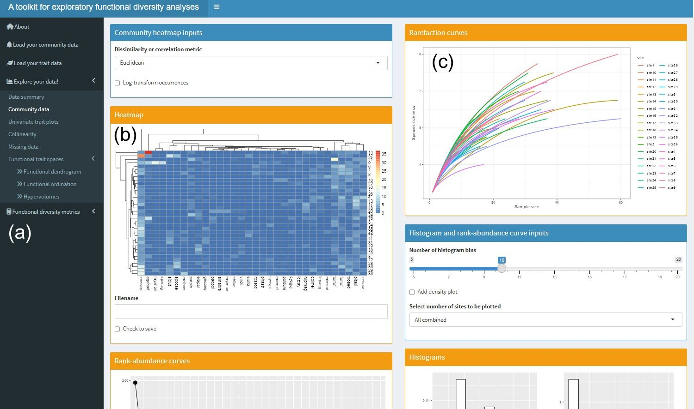

# Summary
Functional diversity, a key aspect of biodiversity, describes the variety of life in terms of species traits (known as functional traits) and how these traits relate to their ecological roles or functions within ecosystems [@Palacio2023]. Functional diversity can be measured using a multitude of methods and approaches, from simple trait-based indices to complex ecosystem models. **divan** is an R Shiny [@shiny] web app that facilitates the exploration of functional diversity data in ecology. The package assembles the outputs of different steps of a functional diversity (FD) workflow [@Palacio2022] in a user-friendly interface, suitable for students, professors, and researchers with different levels of quantitative and computational expertise. The app works mainly as an exploration and interactive data tool based on two main data sources: a site by species matrix (community data) and a species by trait matrix (functional trait data). We note that use of the app is not a substitute for the disciplinary understanding fundamental to the various analyses contained in this application, and that the app should not be treated as a “black box” but rather as a companion to learning about and understanding functional diversity in a given study system. For a broader understanding of the rationale behind the steps contained within this app, please refer the reader to @Palacio2022.

Key features of **divan** include:

* A step-by-step analysis workflow to perform an exploratory functional diversity analysis.

* Summaries of community and functional trait data through tables and plots.

* Assessment of multicollinearity (pairwise correlations, linear and non-linear fits) among functional traits and identification of missing data.

* Construction of functional trait spaces through different approaches (hierarchical clustering, ordination, and probabilistic hypervolumes).

* Computation of functional diversity metrics focusing on different organization levels (sub-alpha, alpha, and beta) and trait space properties (functional richness, divergence, and regularity).

* Visualization of relationships between the estimated metrics.

# Statement of need
Functional diversity, defined as the extent of trait differences among organisms within species assemblages, is a vast, rapidly growing field within ecology [@Mammola2021; @Palacio2023]. This interest has led to the development of a multitude of theoretical and methodological frameworks to estimate functional diversity. Several R packages and functions to compute functional diversity already exist in the literature, including FD [@Laliberte2014], cati [@Taudiere2016], hillR [@Li2018], BAT [@BAT], TPD [@Carmona2019], adiv [@Pavoine2020], RaoRel() [@DeBello2011], and simul.comms() [@Mcpherson2018] (see also @Mammola2021 and @Palacio2022 for a more detailed review of packages). Surprisingly, only one package contains a Shiny web application to perform functional diversity analysis to date (mFD; @Magneville2022 ) – thereby limiting methodological uptake by researchers with less programming experience. Despite this extensive software development, most of the aforementioned R packages rely on a single framework to compute functional diversity metrics (e.g., FD and mFD compute classical indices, hillR is based on Hill numbers, and TPD relies on trait probability density). This becomes a tedious and time-consuming task if users have to combine multiple packages differing in data handling, syntax, input and output interpretation. For instance, depending on the specific scope and research question, ecologists may be interested in, or in need of examining different facets of FD (packages FD and hillR), accounting for intraspecific trait variation (packages TPD and cati), or assessing the impact of different metrics through simulations (function simul.comms). Most importantly, functional diversity analysis comprises a set of several conceptual, logical, and analytical steps [@Palacio2022] that are not considered in the supporting documentation of functional diversity R packages, which list the set of functions they contain alphabetically as per CRAN (The Comprehensive R Archive Network) standards (but see @Magneville2022 ). This renders the development of a stepwise workflow difficult in the absence of additional guides. These issues make it challenging for users to select the most appropriate tools for their needs at each phase of their research, and may discourage ecologists in performing a functional diversity analysis for the first time.

**divan** addresses some of the difficulties that emerge when performing a functional diversity analysis by setting a step-by-step, conceptual workflow of exploratory analyses. **divan** integrates functional diversity computation and plotting, but heavily relies on visual interpretation of the data. It also allows users to visualize functional trait spaces and functional diversity metrics from the perspective of different frameworks (classical and probabilistic hypervolumes). The interface does not require users to learn how to use specific packages or manipulate inputs and outputs of different packages. Instead, it requires only the uploading of a data file describing the species assemblage across sites (community matrix) and a matrix of species traits (trait matrix). Therefore, this application has the potential to be extensively used not only by researchers, but also by professors and students, regardless of their level of familiarity or expertise with FD metrics.

# Overview
The app layout is split into a sidebar, through which the user can navigate across tabs with the different steps of an exploratory functional diversity analysis, and a main window within which the user can visually explore and interact with the different outputs (\autoref{fig:example}). Once the app is running, users can begin the workflow by loading two files: (1) a site by species dataframe (“community matrix”), the usual type of dataset used in classical community ecology, and (2) a species by trait dataframe (“trait matrix”) containing the information about species traits. After loading these two files, numerical and graphical summaries for each dataset are provided in the next submenu down along the sidebar. Beyond this, further sidebar submenus allow for the creation of several plots. The community matrix can be visually explored through a species by site heatmap with dendrogram, individual-based rarefaction curves, rank-abundance curves and species richness and prevalence (proportion of sampling units occupied by each species) histograms. The trait matrix can be visually explored through univariate plots, including boxplots, histograms and kernel density functions. The app also allows the user to assess collinearity between traits through Pearson’s correlations, visual inspection of scatterplots and linear or non-linear model fits, and automatically identifying missing data. Finally, the user can save all the plots produced as a single PDF file for later visualization.

After exploring summaries of the community and trait data, the next step involves constructing a functional trait space (subspace occupied by a set of species in a lower dimensional Euclidean space, in which each axis or dimension represents a functional trait). One of the main benefits of the app is that this space can be built following different approaches. Functional dendrograms use hierarchical clustering [@Petchey2002; @BAT], and allows the user delimiting clusters of species playing similar ecological roles (functional groups; @Walker1992) based on the numerous available algorithms in the package NbClust [@NbClust]. Functional ordination is based on Principal Coordinate Analysis (PCoA), and allows the user selecting different dissimilarity metrics (Euclidean, Gower, Manhattan, Mahalanobis). The reduced space is visualized in two dimensions, along with a convex hull encompassing all the species of the sampling unit and a 2D kernel density estimate (\autoref{fig:example_2}). Information about the PCoA, including percentage of explained variability and a screeplot of the different dimensions, is also provided. The last approach to build functional trait spaces is based on probabilistic hypervolumes [@Blonder2018a; @Blonder2018b], which represent a density-based estimation of the multidimensional trait space, based on the distribution of the species (or any other taxonomic entity) observed therein [@Mammola2020]. The resulting output is a plot of the first two dimensions depicting the species, the random points and the predicted boundaries of the hypervolumes for each sampling unit.

The last step of the workflow involves computing functional diversity indices. Accordingly, the last tab of the application relates to functional diversity estimation and relies on the functional diversity metrics available in the packages FD [@Laliberte2014] and BAT [@BAT]. The metrics computed describe each of the three main facets of functional diversity [@Mouchet2010; @Pavoine2011]: richness (the amount of space species occupy in functional trait space), regularity (evenness of species abundances in functional trait space), and divergence (distance of species abundances to the centroid of the functional trait space). For each dimension, a set of alpha (diversity within a given sampling unit) and beta diversity (changes in diversity between sampling units) metrics is calculated [@Whittaker1972], along with bar plots/histograms and heatmaps, respectively. Additionally, the user can inspect metrics that characterize the contribution of species (sub-alpha diversity) to functional diversity and the functional role of species based on probabilistic hypervolumes in the package BAT [@BAT]. Functional originality quantifies the average dissimilarity between a species (or an individual) and a sample of random points [@Mammola2020; @Mammola2021]. The contribution of each species to functional richness can be quantified through a nearest neighbor method or a leave-one-out approach [@BAT]. Functional originality quantifies the average distance between a species and a sample of random points of the hypervolume. Heatmaps of species contributions to functional richness and functional regularity of each sampling unit, as well as species’ functional originality in each sampling unit are shown.

Finally, a set of scatterplots along with simple regression lines allow the user exploring pairwise relationships among the different metrics calculated. These are shown for both community-level (alpha and beta functional diversity) and species-level (contribution and originality) metrics. The interface contains two data examples (a bird dataset with information on species abundances and functional traits; @Palacio2020 and a plant dataset with plant traits of granite outcrop vegetation in Southwestern Australia; @Ottaviani2016; @Ottaviani2019; @Ottaviani2021 ) and the package documentation includes a user’s guide with detailed information of each function (https://github.com/facuxpalacio/divan).

# Requirements and limitations
In principle, the package needs both data matrices (i.e., community and trait matrices) to fully operate (i.e,. computing functional diversity). However, both matrices are independent from each other, so that the user can explore the community matrix on the one hand (e.g., if the researcher is interested in describing species assemblages), and the trait data table on the other hand (e.g., if the study aims to search for patterns in trait spaces).

The package is not intended to perform a rigorous functional diversity analysis (e.g., relating functional diversity with environmental covariates), but offers explorative tools instead. The application neither allows computing functional diversity accounting for intraspecific trait variability. If this is the case, we suggest the user referring to several packages and functions already available (TPD, cati, RaoRel()). As **divan** is designed for exploratory FD analyses, its ease of use and user-friendly interface make it accessible to a wide range of ecologists, including students, professors, early-career academics, and established academics who want to learn about FD analyses without needing a strong background or experience in this area.

# Software Availability Statement
We used R version 4.3.1 [@base] and the following R packages: abind v. 1.4.5 [@abind], ade4 v. 1.7.22 [@ade42004c; @ade42007a; @ade42007d; @ade42018b; @ade42018e], alphahull v. 2.5 [@alphahull], ape v. 5.7.1 [@ape], askpass v. 1.2.0 [@askpass], backports v. 1.4.1 [@backports], base64enc v. 0.1.3 [@base64enc], BAT v. 2.9.3 [@BAT], brio v. 1.1.3 [@brio], bslib v. 0.5.1 [@bslib], cachem v. 1.0.8 [@cachem], callr v. 3.7.3 [@callr], car v. 3.1.2 [@car], carData v. 3.0.5 [@carData], caret v. 6.0.94 [@caret], clock v. 0.7.0 [@clock], colorspace v. 2.1.0 [@colorspace2009b; @colorspace2009c; @colorspace2020a], commonmark v. 1.9.0 [@commonmark], corrplot v. 0.92 [@corrplot2021], cowplot v. 1.1.1 [@cowplot], cpp11 v. 0.4.6 [@cpp11], crayon v. 1.5.2 [@crayon], crosstalk v. 1.2.0 [@crosstalk], curl v. 5.0.2 [@curl], data.table v. 1.14.8 [@datatable], deldir v. 1.0.9 [@deldir], dendextend v. 1.17.1 [@dendextend], DEoptimR v. 1.1.2 [@DEoptimR], desc v. 1.4.2 [@desc], diagram v. 1.6.5 [@diagram], diffobj v. 0.3.5 [@diffobj], digest v. 0.6.33 [@digest], doParallel v. 1.0.17 [@doParallel], DT v. 0.29 [@DT], e1071 v. 1.7.13 [@e1071], ellipse v. 0.5.0 [@ellipse], ellipsis v. 0.3.2 [@ellipsis], emmeans v. 1.8.8 [@emmeans], estimability v. 1.4.1 [@estimability], evaluate v. 0.21 [@evaluate], factoextra v. 1.0.7 [@factoextra], FactoMineR v. 2.8 [@FactoMineR], fansi v. 1.0.4 [@fansi], farver v. 2.1.1 [@farver], fastcluster v. 1.2.3 [@fastcluster], fastmap v. 1.1.1 [@fastmap], FD v. 1.0.12.1 [@FD2010; @FD2014], flashClust v. 1.1.2 [@flashClust], FNN v. 1.1.3.2 [@FNN], fontawesome v. 0.5.2 [@fontawesome], foreach v. 1.5.2 [@foreach], fs v. 1.6.3 [@fs], future v. 1.33.0 [@RJ-2021-048], future.apply v. 1.11.0 [@RJ-2021-048], generics v. 0.1.3 [@generics], geometry v. 0.4.7 [@geometry], GGally v. 2.1.2 [@GGally], ggpubr v. 0.6.0 [@ggpubr], ggrepel v. 0.9.3 [@ggrepel], ggsci v. 3.0.0 [@ggsci], ggsignif v. 0.6.4 [@ggsignif], globals v. 0.16.2 [@globals], glue v. 1.6

# Acknowledgements
FXP acknowledges financial support by Consejo Nacional de Investigaciones Científicas y Técnicas (Project PIBAA 28720210100513CO). Federico Riva, Gianluigi Ottaviani, and Stefano Mammola provided thoughtful comments on this manuscript.

# References

