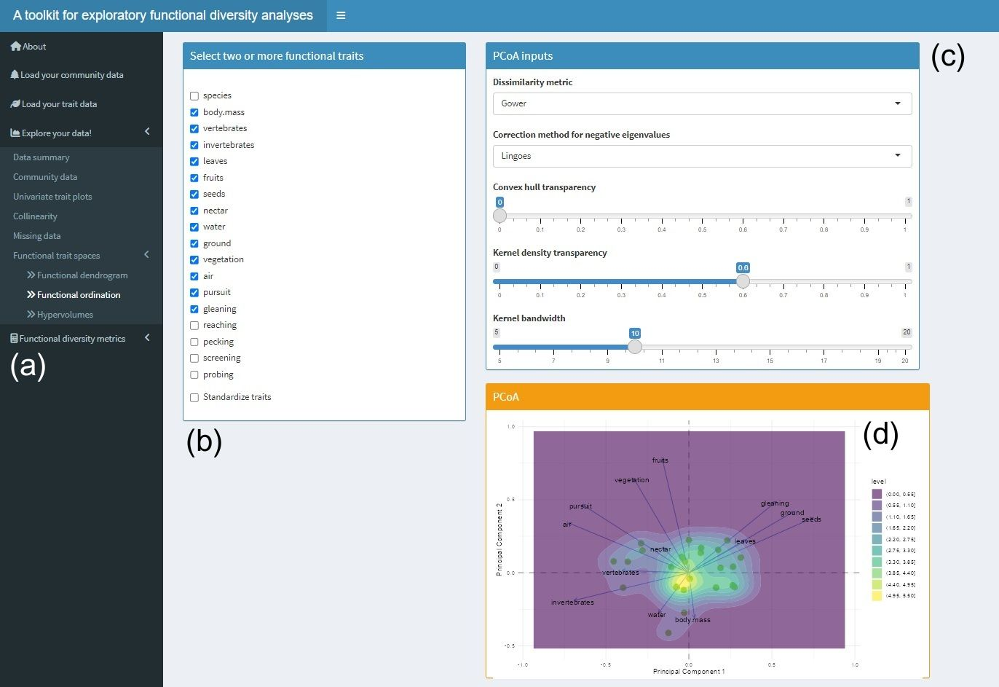

# Summary

Functional diversity, a key aspect of biodiversity, describes the
variety of life in terms of species traits (known as functional traits)
and how these traits relate to their ecological roles or functions
within ecosystems (Palacio 2023). Functional diversity can be measured
using a multitude of methods and approaches, from simple trait-based
indices to complex ecosystem models. **divan** is an R Shiny (Chang et
al. 2022) web app that facilitates the exploration of functional
diversity data in ecology. The package assembles the outputs of
different steps of a functional diversity (FD) workflow (Palacio et al.
2022) in a user-friendly interface, suitable for students, professors,
and researchers with different levels of quantitative and computational
expertise. The app works mainly as an exploration and interactive data
tool based on two main data sources: a site by species matrix (community
data) and a species by trait matrix (functional trait data). We note
that use of the app is not a substitute for the disciplinary
understanding fundamental to the various analyses contained in this
application, and that the app should not be treated as a “black box” but
rather as a companion to learning about and understanding functional
diversity in a given study system. For a broader understanding of the
rationale behind the steps contained within this app, please refer the
reader to Palacio et al. (2022).

Key features of **divan** include:

-   A step-by-step analysis workflow to perform an exploratory
    functional diversity analysis.

-   Summaries of community and functional trait data through tables and
    plots.

-   Assessment of multicollinearity (pairwise correlations, linear and
    non-linear fits) among functional traits and identification of
    missing data.

-   Construction of functional trait spaces through different approaches
    (hierarchical clustering, ordination, and probabilistic
    hypervolumes).

-   Computation of functional diversity metrics focusing on different
    organization levels (sub-alpha, alpha, and beta) and trait space
    properties (functional richness, divergence, and regularity).

-   Visualization of relationships between the estimated metrics.

# Statement of need

Functional diversity, defined as the extent of trait differences among
organisms within species assemblages, is a vast, rapidly growing field
within ecology (Mammola et al. 2021; Palacio 2023). This interest has
led to the development of a multitude of theoretical and methodological
frameworks to estimate functional diversity. Several R packages and
functions to compute functional diversity already exist in the
literature, including FD (Laliberté and Legendre 2014), cati (Taudiere
and Violle 2016), hillR (Li 2018), BAT (Cardoso et al. 2022), TPD
(Carmona et al. 2019), adiv (Pavoine 2020), RaoRel() (De Bello et al.
2011), and simul.comms() (Mcpherson, Yeager, and Baum 2018) (see also
Mammola et al. (2021) and Palacio et al. (2022) for a more detailed
review of packages). Surprisingly, only one package contains a Shiny web
application to perform functional diversity analysis to date (mFD;
Magneville et al. (2022) ) – thereby limiting methodological uptake by
researchers with less programming experience. Despite this extensive
software development, most of the aforementioned R packages rely on a
single framework to compute functional diversity metrics (e.g., FD and
mFD compute classical indices, hillR is based on Hill numbers, and TPD
relies on trait probability density). This becomes a tedious and
time-consuming task if users have to combine multiple packages differing
in data handling, syntax, input and output interpretation. For instance,
depending on the specific scope and research question, ecologists may be
interested in, or in need of examining different facets of FD (packages
FD and hillR), accounting for intraspecific trait variation (packages
TPD and cati), or assessing the impact of different metrics through
simulations (function simul.comms). Most importantly, functional
diversity analysis comprises a set of several conceptual, logical, and
analytical steps (Palacio et al. 2022) that are not considered in the
supporting documentation of functional diversity R packages, which list
the set of functions they contain alphabetically as per CRAN (The
Comprehensive R Archive Network) standards (but see Magneville et al.
(2022) ). This renders the development of a stepwise workflow difficult
in the absence of additional guides. These issues make it challenging
for users to select the most appropriate tools for their needs at each
phase of their research, and may discourage ecologists in performing a
functional diversity analysis for the first time.

**divan** addresses some of the difficulties that emerge when performing
a functional diversity analysis by setting a step-by-step, conceptual
workflow of exploratory analyses. **divan** integrates functional
diversity computation and plotting, but heavily relies on visual
interpretation of the data. It also allows users to visualize functional
trait spaces and functional diversity metrics from the perspective of
different frameworks (classical and probabilistic hypervolumes). The
interface does not require users to learn how to use specific packages
or manipulate inputs and outputs of different packages. Instead, it
requires only the uploading of a data file describing the species
assemblage across sites (community matrix) and a matrix of species
traits (trait matrix). Therefore, this application has the potential to
be extensively used not only by researchers, but also by professors and
students, regardless of their level of familiarity or expertise with FD
metrics.

# Overview

The app layout is split into a sidebar, through which the user can
navigate across tabs with the different steps of an exploratory
functional diversity analysis, and a main window within which the user
can visually explore and interact with the different outputs (). Once
the app is running, users can begin the workflow by loading two files:
(1) a site by species dataframe (“community matrix”), the usual type of
dataset used in classical community ecology, and (2) a species by trait
dataframe (“trait matrix”) containing the information about species
traits. After loading these two files, numerical and graphical summaries
for each dataset are provided in the next submenu down along the
sidebar. Beyond this, further sidebar submenus allow for the creation of
several plots. The community matrix can be visually explored through a
species by site heatmap with dendrogram, individual-based rarefaction
curves, rank-abundance curves and species richness and prevalence
(proportion of sampling units occupied by each species) histograms. The
trait matrix can be visually explored through univariate plots,
including boxplots, histograms and kernel density functions. The app
also allows the user to assess collinearity between traits through
Pearson’s correlations, visual inspection of scatterplots and linear or
non-linear model fits, and automatically identifying missing data.
Finally, the user can save all the plots produced as a single PDF file
for later visualization.

<figure>

<figcaption aria-hidden="true">Figure 1. The graphical user interface
(GUI) of <strong>divan</strong> after loading a community matrix. (a)
Sidebar menu, (b) heatmap plus dendrogram of the community matrix, (c)
rarefaction curves of individual sites. </figcaption>
</figure>

After exploring summaries of the community and trait data, the next step
involves constructing a functional trait space (subspace occupied by a
set of species in a lower dimensional Euclidean space, in which each
axis or dimension represents a functional trait). One of the main
benefits of the app is that this space can be built following different
approaches. Functional dendrograms use hierarchical clustering (Petchey
and Gaston 2002; Cardoso et al. 2022), and allows the user delimiting
clusters of species playing similar ecological roles (functional groups;
Walker (1992)) based on the numerous available algorithms in the package
NbClust (Charrad et al. 2014). Functional ordination is based on
Principal Coordinate Analysis (PCoA), and allows the user selecting
different dissimilarity metrics (Euclidean, Gower, Manhattan,
Mahalanobis). The reduced space is visualized in two dimensions, along
with a convex hull encompassing all the species of the sampling unit and
a 2D kernel density estimate (). Information about the PCoA, including
percentage of explained variability and a screeplot of the different
dimensions, is also provided. The last approach to build functional
trait spaces is based on probabilistic hypervolumes (Blonder et al.
2018; Blonder 2018), which represent a density-based estimation of the
multidimensional trait space, based on the distribution of the species
(or any other taxonomic entity) observed therein (Mammola and Cardoso
2020). The resulting output is a plot of the first two dimensions
depicting the species, the random points and the predicted boundaries of
the hypervolumes for each sampling unit.

<figure>

<figcaption aria-hidden="true">Figure 2. The GUI of divan after loading
a trait matrix. (a) Sidebar menu, (b) selection of functional traits for
analysis and plotting, (c) Principal Coordinate Analysis (PCoA) inputs,
(d) biplot of species and functional traits plus density kernel
surface.</figcaption>
</figure>

The last step of the workflow involves computing functional diversity
indices. Accordingly, the last tab of the application relates to
functional diversity estimation and relies on the functional diversity
metrics available in the packages FD (Laliberté and Legendre 2014) and
BAT (Cardoso et al. 2022). The metrics computed describe each of the
three main facets of functional diversity (Mouchet et al. 2010; Pavoine
and Bonsall 2011): richness (the amount of space species occupy in
functional trait space), regularity (evenness of species abundances in
functional trait space), and divergence (distance of species abundances
to the centroid of the functional trait space). For each dimension, a
set of alpha (diversity within a given sampling unit) and beta diversity
(changes in diversity between sampling units) metrics is calculated
(Whittaker 1972), along with bar plots/histograms and heatmaps,
respectively. Additionally, the user can inspect metrics that
characterize the contribution of species (sub-alpha diversity) to
functional diversity and the functional role of species based on
probabilistic hypervolumes in the package BAT (Cardoso et al. 2022).
Functional originality quantifies the average dissimilarity between a
species (or an individual) and a sample of random points (Mammola and
Cardoso 2020; Mammola et al. 2021). The contribution of each species to
functional richness can be quantified through a nearest neighbor method
or a leave-one-out approach (Cardoso et al. 2022). Functional
originality quantifies the average distance between a species and a
sample of random points of the hypervolume. Heatmaps of species
contributions to functional richness and functional regularity of each
sampling unit, as well as species’ functional originality in each
sampling unit are shown.

Finally, a set of scatterplots along with simple regression lines allow
the user exploring pairwise relationships among the different metrics
calculated. These are shown for both community-level (alpha and beta
functional diversity) and species-level (contribution and originality)
metrics. The interface contains two data examples (a bird dataset with
information on species abundances and functional traits; Palacio,
Maragliano, and Montalti (2020) and a plant dataset with plant traits of
granite outcrop vegetation in Southwestern Australia; Ottaviani,
Marcantonio, and Mucina (2016); Ottaviani et al. (2019); Ottaviani and
Marcantonio (2021) ) and the package documentation includes a user’s
guide with detailed information of each function
(<https://github.com/facuxpalacio/divan>).

Requirements and limitations In principle, the package needs both data
matrices (i.e., community and trait matrices) to fully operate (i.e,.
computing functional diversity). However, both matrices are independent
from each other, so that the user can explore the community matrix on
the one hand (e.g., if the researcher is interested in describing
species assemblages), and the trait data table on the other hand (e.g.,
if the study aims to search for patterns in trait spaces).

The package is not intended to perform a rigorous functional diversity
analysis (e.g., relating functional diversity with environmental
covariates), but offers explorative tools instead. The application
neither allows computing functional diversity accounting for
intraspecific trait variability. If this is the case, we suggest the
user referring to several packages and functions already available (TPD,
cati, RaoRel()). As **divan** is designed for exploratory FD analyses,
its ease of use and user-friendly interface make it accessible to a wide
range of ecologists, including students, professors, early-career
academics, and established academics who want to learn about FD analyses
without needing a strong background or experience in this area.

# Software Availability Statement

We used R version 4.3.1 (R Core Team 2023) and the following R packages:
abind v. 1.4.5 (Plate and Heiberger 2016), ade4 v. 1.7.22 (Chessel,
Dufour, and Thioulouse 2004; Dray and Dufour 2007; Dray, Dufour, and
Chessel 2007; Bougeard and Dray 2018; Thioulouse et al. 2018), alphahull
v. 2.5 (Pateiro-Lopez, Rodriguez-Casal, and. 2022), ape v. 5.7.1
(Paradis and Schliep 2019), askpass v. 1.2.0 (Ooms 2019), backports v.
1.4.1 (Lang and R Core Team 2021), base64enc v. 0.1.3 (Urbanek 2015),
BAT v. 2.9.3 (Cardoso et al. 2022), brio v. 1.1.3 (Hester and Csárdi
2021), bslib v. 0.5.1 (Sievert, Cheng, and Aden-Buie 2023), cachem v.
1.0.8 (Chang 2023a), callr v. 3.7.3 (Csárdi and Chang 2022), car v.
3.1.2 (Fox and Weisberg 2019), carData v. 3.0.5 (Fox, Weisberg, and
Price 2022), caret v. 6.0.94 (Kuhn and Max 2008), clock v. 0.7.0
(Vaughan 2023), colorspace v. 2.1.0 (Zeileis, Hornik, and Murrell 2009;
Stauffer et al. 2009; Zeileis et al. 2020), commonmark v. 1.9.0 (Ooms
2023a), corrplot v. 0.92 (Wei and Simko 2021), cowplot v. 1.1.1 (Wilke
2020), cpp11 v. 0.4.6 (Hester and François 2022), crayon v. 1.5.2
(Csárdi 2022), crosstalk v. 1.2.0 (Cheng and Sievert 2021), curl v.
5.0.2 (Ooms 2023b), data.table v. 1.14.8 (Dowle and Srinivasan 2023),
deldir v. 1.0.9 (Turner 2023), dendextend v. 1.17.1 (Galili 2015),
DEoptimR v. 1.1.2 (Conceicao 2023), desc v. 1.4.2 (Csárdi, Müller, and
Hester 2022), diagram v. 1.6.5 (Soetaert 2020), diffobj v. 0.3.5 (Gaslam
2021), digest v. 0.6.33 (Antoine Lucas et al. 2022), doParallel v.
1.0.17 (Corporation and Weston 2022), DT v. 0.29 (Xie, Cheng, and Tan
2023), e1071 v. 1.7.13 (Meyer et al. 2023), ellipse v. 0.5.0 (Murdoch
and Chow 2023), ellipsis v. 0.3.2 (Wickham 2021), emmeans v. 1.8.8 (R.
V. Lenth 2023), estimability v. 1.4.1 (R. Lenth 2022), evaluate v. 0.21
(Wickham and Xie 2023), factoextra v. 1.0.7 (Kassambara and Mundt 2020),
FactoMineR v. 2.8 (Lê, Josse, and Husson 2008), fansi v. 1.0.4 (Gaslam
2023), farver v. 2.1.1 (Pedersen, Nicolae, and François 2022),
fastcluster v. 1.2.3 (Müllner 2013), fastmap v. 1.1.1 (Chang 2023b), FD
v. 1.0.12.1 (Laliberté and Legendre 2010; Laliberté, Legendre, and
Shipley 2014), flashClust v. 1.1.2 (Langfelder and Horvath 2012), FNN v.
1.1.3.2 (Beygelzimer et al. 2023), fontawesome v. 0.5.2 (Iannone 2023),
foreach v. 1.5.2 (Microsoft and Weston 2022), fs v. 1.6.3 (Hester,
Wickham, and Csárdi 2023), future v. 1.33.0 (Bengtsson 2021),
future.apply v. 1.11.0 (Bengtsson 2021), generics v. 0.1.3 (Wickham,
Kuhn, and Vaughan 2022), geometry v. 0.4.7 (Habel et al. 2023), GGally
v. 2.1.2 (Schloerke et al. 2021), ggpubr v. 0.6.0 (Kassambara 2023),
ggrepel v. 0.9.3 (Slowikowski 2023), ggsci v. 3.0.0 (Xiao 2023),
ggsignif v. 0.6.4 (Constantin and Patil 2021), globals v. 0.16.2
(Bengtsson 2022), glue v. 1.6

# References

Antoine Lucas, Dirk Eddelbuettel with contributions by, Jarek Tuszynski,
Henrik Bengtsson, Simon Urbanek, Mario Frasca, Bryan Lewis, Murray
Stokely, et al. 2022. *digest: Create
Compact Hash Digests of r Objects*.
<https://CRAN.R-project.org/package=digest>.

Bengtsson, Henrik. 2021. “A Unifying Framework for Parallel and
Distributed Processing in r Using Futures.” *The R Journal* 13 (2):
208–27. <https://doi.org/10.32614/RJ-2021-048>.

———. 2022. *globals: Identify Global Objects
in r Expressions*. <https://CRAN.R-project.org/package=globals>.

Beygelzimer, Alina, Sham Kakadet, John Langford, Sunil Arya, David
Mount, and Shengqiao Li. 2023. *FNN: Fast Nearest Neighbor Search
Algorithms and Applications*. <https://CRAN.R-project.org/package=FNN>.

Blonder, Benjamin. 2018. “Hypervolume Concepts in Niche‐ and Trait‐based
Ecology.” *Ecography* 41 (9): 1441–55.
<https://doi.org/10.1111/ecog.03187>.

Blonder, Benjamin, Cecina Morrow, Brian Maitner, David Harris, Christine
Lamanna, Cyrille Violle, Brian Enquist, and Andrew Kerkhoff. 2018. “New
Approaches for Delineating &lt;i&gt;n&lt;/i&gt;‐dimensional
Hypervolumes.” *Methods in Ecology and Evolution* 9 (2): 305–19.
<https://doi.org/10.1111/2041-210x.12865>.

Bougeard, Stéphanie, and Stéphane Dray. 2018. “Supervised Multiblock
Analysis in R with the ade4 Package.”
*Journal of Statistical Software* 86 (1): 1–17.
<https://doi.org/10.18637/jss.v086.i01>.

Cardoso, Pedro, Stefano Mammola, Francois Rigal, and Jose Carvalho.
2022. *BAT: Biodiversity Assessment Tools*.
<https://CRAN.R-project.org/package=BAT>.

Carmona, Carlos, Francesco De Bello, Norman Mason, and Jan Lepš. 2019.
“Trait Probability Density (TPD): Measuring Functional Diversity Across
Scales Based on TPD with r.” *Ecology* 100 (12).
<https://doi.org/10.1002/ecy.2876>.

Chang, Winston. 2023a. *cachem: Cache r
Objects with Automatic Pruning*.
<https://CRAN.R-project.org/package=cachem>.

———. 2023b. *fastmap: Fast Data Structures*.
<https://CRAN.R-project.org/package=fastmap>.

Chang, Winston, Joe Cheng, JJ Allaire, Carson Sievert, Barret Schloerke,
Yihui Xie, Jeff Allen, Jonathan McPherson, Alan Dipert, and Barbara
Borges. 2022. *shiny: Web Application
Framework for r*. <https://CRAN.R-project.org/package=shiny>.

Charrad, Malika, Nadia Ghazzali, Véronique Boiteau, and Azam Niknafs.
2014. “NbClust: An R Package for Determining the Relevant Number of
Clusters in a Data Set.” *Journal of Statistical Software* 61 (6): 1–36.
<https://www.jstatsoft.org/v61/i06/>.

Cheng, Joe, and Carson Sievert. 2021.
*crosstalk: Inter-Widget Interactivity for
HTML Widgets*. <https://CRAN.R-project.org/package=crosstalk>.

Chessel, Daniel, Anne-Béatrice Dufour, and Jean Thioulouse. 2004. “The
ade4 Package – I: One-Table Methods.” *R
News* 4 (1): 5–10. <https://cran.r-project.org/doc/Rnews/>.

Conceicao, Eduardo L. T. 2023. *DEoptimR: Differential Evolution
Optimization in Pure r*. <https://CRAN.R-project.org/package=DEoptimR>.

Constantin, Ahlmann-Eltze, and Indrajeet Patil. 2021.
“ggsignif: R Package for Displaying
Significance Brackets for ‘ggplot2’.”
*PsyArxiv*. <https://doi.org/10.31234/osf.io/7awm6>.

Corporation, Microsoft, and Steve Weston. 2022.
*doParallel: Foreach Parallel Adaptor for
the “parallel” Package*.
<https://CRAN.R-project.org/package=doParallel>.

Csárdi, Gábor. 2022. *crayon: Colored
Terminal Output*. <https://CRAN.R-project.org/package=crayon>.

Csárdi, Gábor, and Winston Chang. 2022.
*callr: Call r from r*.
<https://CRAN.R-project.org/package=callr>.

Csárdi, Gábor, Kirill Müller, and Jim Hester. 2022.
*desc: Manipulate DESCRIPTION Files*.
<https://CRAN.R-project.org/package=desc>.

De Bello, Francesco, Sandra Lavorel, Cécile Albert, Wilfried Thuiller,
Karl Grigulis, Jiři Dolezal, Štepán Janeček, and Jan Lepš. 2011.
“Quantifying the Relevance of Intraspecific Trait Variability for
Functional Diversity.” *Methods in Ecology and Evolution* 2 (2): 163–74.
<https://doi.org/10.1111/j.2041-210x.2010.00071.x>.

Dowle, Matt, and Arun Srinivasan. 2023.
*data.table: Extension of
“data.frame”*.
<https://CRAN.R-project.org/package=data.table>.

Dray, Stéphane, and Anne–Béatrice Dufour. 2007. “The
ade4 Package: Implementing the Duality
Diagram for Ecologists.” *Journal of Statistical Software* 22 (4): 1–20.
<https://doi.org/10.18637/jss.v022.i04>.

Dray, Stéphane, Anne-Béatrice Dufour, and Daniel Chessel. 2007. “The
ade4 Package – II: Two-Table and K-Table
Methods.” *R News* 7 (2): 47–52.
<https://cran.r-project.org/doc/Rnews/>.

Fox, John, and Sanford Weisberg. 2019. *An R Companion to Applied
Regression*. Third. Thousand Oaks CA: Sage.
<https://socialsciences.mcmaster.ca/jfox/Books/Companion/>.

Fox, John, Sanford Weisberg, and Brad Price. 2022.
*carData: Companion to Applied Regression
Data Sets*. <https://CRAN.R-project.org/package=carData>.

Galili, Tal. 2015. “dendextend: An r Package
for Visualizing, Adjusting, and Comparing Trees of Hierarchical
Clustering.” *Bioinformatics*.
<https://doi.org/10.1093/bioinformatics/btv428>.

Gaslam, Brodie. 2021. *diffobj: Diffs for r
Objects*. <https://CRAN.R-project.org/package=diffobj>.

———. 2023. *fansi: ANSI Control Sequence
Aware String Functions*. <https://CRAN.R-project.org/package=fansi>.

Habel, Kai, Raoul Grasman, Robert B. Gramacy, Pavlo Mozharovskyi, and
David C. Sterratt. 2023. *geometry: Mesh
Generation and Surface Tessellation*.
<https://CRAN.R-project.org/package=geometry>.

Hester, Jim, and Gábor Csárdi. 2021. *brio:
Basic r Input Output*. <https://CRAN.R-project.org/package=brio>.

Hester, Jim, and Romain François. 2022. *Cpp11: A c++11 Interface for
r’s c Interface*. <https://CRAN.R-project.org/package=cpp11>.

Hester, Jim, Hadley Wickham, and Gábor Csárdi. 2023.
*fs: Cross-Platform File System Operations
Based on “libuv”*.
<https://CRAN.R-project.org/package=fs>.

Iannone, Richard. 2023. *fontawesome: Easily
Work with “Font Awesome” Icons*.
<https://CRAN.R-project.org/package=fontawesome>.

Kassambara, Alboukadel. 2023. *ggpubr:
“ggplot2” Based Publication Ready Plots*.
<https://CRAN.R-project.org/package=ggpubr>.

Kassambara, Alboukadel, and Fabian Mundt. 2020.
*factoextra: Extract and Visualize the
Results of Multivariate Data Analyses*.
<https://CRAN.R-project.org/package=factoextra>.

Kuhn, and Max. 2008. “Building Predictive Models in r Using the Caret
Package.” *Journal of Statistical Software* 28 (5): 1–26.
<https://doi.org/10.18637/jss.v028.i05>.

Laliberté, Etienne, and Pierre Legendre. 2010. “A Distance-Based
Framework for Measuring Functional Diversity from Multiple Traits.”
*Ecology* 91: 299–305.

———. 2014. “A Distance‐based Framework for Measuring Functional
Diversity from Multiple Traits.” *Ecology* 91 (1): 299–305.
<https://doi.org/10.1890/08-2244.1>.

Laliberté, Etienne, Pierre Legendre, and Bill Shipley. 2014. *FD:
Measuring Functional Diversity from Multiple Traits, and Other Tools for
Functional Ecology*.

Lang, Michel, and R Core Team. 2021.
*backports: Reimplementations of Functions
Introduced Since r-3.0.0*.
<https://CRAN.R-project.org/package=backports>.

Langfelder, Peter, and Steve Horvath. 2012. “Fast R Functions for Robust
Correlations and Hierarchical Clustering.” *Journal of Statistical
Software* 46 (11): 1–17. <http://www.jstatsoft.org/v46/i11/>.

Lê, Sébastien, Julie Josse, and François Husson. 2008. “FactoMineR: A
Package for Multivariate Analysis.” *Journal of Statistical Software* 25
(1): 1–18. <https://doi.org/10.18637/jss.v025.i01>.

Lenth, Russell. 2022. *estimability: Tools
for Assessing Estimability of Linear Predictions*.
<https://CRAN.R-project.org/package=estimability>.

Lenth, Russell V. 2023. *emmeans: Estimated
Marginal Means, Aka Least-Squares Means*.
<https://CRAN.R-project.org/package=emmeans>.

Li, Daijiang. 2018. “hillR: Taxonomic, Functional, and Phylogenetic
Diversity and Similarity Through Hill Numbers.” *Journal of Open Source
Software* 3 (31): 1041. <https://doi.org/10.21105/joss.01041>.

Magneville, C, N Loiseau, C Albouy, N Casajus, T Claverie, A Escalas,.
Villéger, and S. 2022. “mFD: An r Package to Compute and Illustrate the
Multiple Facets of Functional Diversity.” *Ecography*, no. 1: 2022.

Mammola, Stefano, and Pedro Cardoso. 2020. “Functional Diversity Metrics
Using Kernel Density &lt;i&gt;n&lt;/i&gt;-Dimensional Hypervolumes.”
*Methods in Ecology and Evolution* 11 (8): 986–95.
<https://doi.org/10.1101/2020.01.25.919373>.

Mammola, Stefano, Carlos Carmona, Thomas Guillerme, and Pedro Cardoso.
2021. “Concepts and Applications in Functional Diversity.” *Functional
Ecology* 35 (9): 1869–85. <https://doi.org/10.32942/osf.io/j64nt>.

Mcpherson, Jana, Lauren Yeager, and Julia Baum. 2018. “A Simulation Tool
to Scrutinise the Behaviour of Functional Diversity Metrics.” *Methods
in Ecology and Evolution* 9 (1): 200–206.
<https://doi.org/10.1111/2041-210x.12855>.

Meyer, David, Evgenia Dimitriadou, Kurt Hornik, Andreas Weingessel, and
Friedrich Leisch. 2023. *E1071: Misc Functions of the Department of
Statistics, Probability Theory Group (Formerly: E1071), TU Wien*.
<https://CRAN.R-project.org/package=e1071>.

Microsoft, and Steve Weston. 2022. *foreach:
Provides Foreach Looping Construct*.
<https://CRAN.R-project.org/package=foreach>.

Mouchet, Maud, Sébastien Villéger, Norman Mason, and David Mouillot.
2010. “Functional Diversity Measures: An Overview of Their Redundancy
and Their Ability to Discriminate Community Assembly Rules.” *Functional
Ecology* 24 (4): 867–76.
<https://doi.org/10.1111/j.1365-2435.2010.01695.x>.

Müllner, Daniel. 2013. “fastcluster: Fast
Hierarchical, Agglomerative Clustering Routines for R and Python.”
*Journal of Statistical Software* 53 (9): 1–18.
<https://www.jstatsoft.org/v53/i09/>.

Murdoch, Duncan, and E. D. Chow. 2023.
*ellipse: Functions for Drawing Ellipses and
Ellipse-Like Confidence Regions*.
<https://CRAN.R-project.org/package=ellipse>.

Ooms, Jeroen. 2019. *askpass: Safe Password
Entry for r, Git, and SSH*.
<https://CRAN.R-project.org/package=askpass>.

———. 2023a. *commonmark: High Performance
CommonMark and Github Markdown Rendering in r*.
<https://CRAN.R-project.org/package=commonmark>.

———. 2023b. *curl: A Modern and Flexible Web
Client for r*. <https://CRAN.R-project.org/package=curl>.

Ottaviani, Gianluigi, Gunnar Keppel, Matteo Marcantonio, Ladislav
Mucina, and Grant Wardell‐johnson. 2019. “Woody Species in Resource‐rich
Microrefugia of Granite Outcrops Display Unique Functional Signatures.”
*Austral Ecology* 44 (4): 575–80. <https://doi.org/10.1111/aec.12745>.

Ottaviani, Gianluigi, and Matteo Marcantonio. 2021. “Precipitation
Seasonality Promotes Acquisitive and Variable Leaf Water-Economics
Traits in Southwest Australian Granite Outcrop Species.” *Biological
Journal of the Linnean Society* 133 (2): 411–17.
<https://doi.org/10.1093/biolinnean/blaa053>.

Ottaviani, Gianluigi, Matteo Marcantonio, and Ladislav Mucina. 2016.
“Soil Depth Shapes Plant Functional Diversity in Granite Outcrops
Vegetation of Southwestern Australia.” *Plant Ecology &Amp; Diversity* 9
(3): 263–76. <https://doi.org/10.1080/17550874.2016.1211192>.

Palacio, Facundo. 2023. “Functional Diversity.” In *Encyclopedia of
Biodiversity*, 504–17. Elsevier.
<https://doi.org/10.1016/b978-0-12-822562-2.00342-x>.

Palacio, Facundo, Corey Callaghan, Pedro Cardoso, Emma Hudgins, Marta
Jarzyna, Gianluigi Ottaviani, Federico Riva, Caio Graco-Roza, Vaughn
Shirey, and Stefano Mammola. 2022. “A Protocol for Reproducible
Functional Diversity Analyses.” *Ecography* 2022 (11): 6287.
<https://doi.org/10.32942/osf.io/yt9sb>.

Palacio, Facundo, René Maragliano, and Diego Montalti. 2020. “The Costs
of Ignoring Species Detectability on Functional Diversity Estimation.”
*The Auk* 137 (4). <https://doi.org/10.1093/auk/ukaa057>.

Paradis, Emmanuel, and Klaus Schliep. 2019. “Ape 5.0: An Environment for
Modern Phylogenetics and Evolutionary Analyses in R.” *Bioinformatics*
35: 526–28. <https://doi.org/10.1093/bioinformatics/bty633>.

Pateiro-Lopez, Beatriz, Alberto Rodriguez-Casal, and. 2022.
*alphahull: Generalization of the Convex
Hull of a Sample of Points in the Plane*.
<https://CRAN.R-project.org/package=alphahull>.

Pavoine, S. 2020. *Methods in Ecology and Evolution* 11: 1106–12.

Pavoine, S, and M Bonsall. 2011. “Measuring Biodiversity to Explain
Community Assembly: A Unified Approach.” *Biological Reviews* 86 (4):
792–812. <https://doi.org/10.1111/j.1469-185x.2010.00171.x>.

Pedersen, Thomas Lin, Berendea Nicolae, and Romain François. 2022.
*farver: High Performance Colour Space
Manipulation*. <https://CRAN.R-project.org/package=farver>.

Petchey, Owen, and Kevin Gaston. 2002. “Functional Diversity (FD),
Species Richness and Community Composition.” *Ecology Letters* 5 (3):
402–11. <https://doi.org/10.1046/j.1461-0248.2002.00339.x>.

Plate, Tony, and Richard Heiberger. 2016.
*abind: Combine Multidimensional Arrays*.
<https://CRAN.R-project.org/package=abind>.

R Core Team. 2023. *R: A Language and Environment for Statistical
Computing*. Vienna, Austria: R Foundation for Statistical Computing.
<https://www.R-project.org/>.

Schloerke, Barret, Di Cook, Joseph Larmarange, Francois Briatte, Moritz
Marbach, Edwin Thoen, Amos Elberg, and Jason Crowley. 2021. *GGally:
Extension to “ggplot2”*.
<https://CRAN.R-project.org/package=GGally>.

Sievert, Carson, Joe Cheng, and Garrick Aden-Buie. 2023.
*bslib: Custom “Bootstrap” “Sass” Themes for
“shiny” and
“rmarkdown”*.
<https://CRAN.R-project.org/package=bslib>.

Slowikowski, Kamil. 2023. *ggrepel:
Automatically Position Non-Overlapping Text Labels with
“ggplot2”*.
<https://CRAN.R-project.org/package=ggrepel>.

Soetaert, Karline. 2020. *diagram: Functions
for Visualising Simple Graphs (Networks), Plotting Flow Diagrams*.
<https://CRAN.R-project.org/package=diagram>.

Stauffer, Reto, Georg J. Mayr, Markus Dabernig, and Achim Zeileis. 2009.
“Somewhere over the Rainbow: How to Make Effective Use of Colors in
Meteorological Visualizations.” *Bulletin of the American Meteorological
Society* 96 (2): 203–16. <https://doi.org/10.1175/BAMS-D-13-00155.1>.

Taudiere, Adrien, and Cyrille Violle. 2016. “Cati: An r Package Using
Functional Traits to Detect and Quantify Multi‐level Community Assembly
Processes.” *Ecography* 39 (7): 699–708.
<https://doi.org/10.1111/ecog.01433>.

Thioulouse, Jean, Stéphane Dray, Anne–Béatrice Dufour, Aurélie
Siberchicot, Thibaut Jombart, and Sandrine Pavoine. 2018. *Multivariate
Analysis of Ecological Data with ade4*.
Springer. <https://doi.org/10.1007/978-1-4939-8850-1>.

Turner, Rolf. 2023. *deldir: Delaunay
Triangulation and Dirichlet (Voronoi) Tessellation*.
<https://CRAN.R-project.org/package=deldir>.

Urbanek, Simon. 2015. *Base64enc: Tools for Base64 Encoding*.
<https://CRAN.R-project.org/package=base64enc>.

Vaughan, Davis. 2023. *clock: Date-Time
Types and Tools*. <https://CRAN.R-project.org/package=clock>.

Walker, Brian. 1992. “Biodiversity and Ecological Redundancy.”
*Conservation Biology* 6 (1): 18–23.
<https://doi.org/10.1046/j.1523-1739.1992.610018.x>.

Wei, Taiyun, and Viliam Simko. 2021. *R Package
“corrplot”: Visualization of a Correlation
Matrix*. <https://github.com/taiyun/corrplot>.

Whittaker, R. 1972. “EVOLUTION AND MEASUREMENT OF SPECIES DIVERSITY.”
*TAXON* 21 (2-3): 213–51. <https://doi.org/10.2307/1218190>.

Wickham, Hadley. 2021. *ellipsis: Tools for
Working with ...* <https://CRAN.R-project.org/package=ellipsis>.

Wickham, Hadley, Max Kuhn, and Davis Vaughan. 2022.
*generics: Common S3 Generics Not Provided
by Base r Methods Related to Model Fitting*.
<https://CRAN.R-project.org/package=generics>.

Wickham, Hadley, and Yihui Xie. 2023.
*evaluate: Parsing and Evaluation Tools That
Provide More Details Than the Default*.
<https://CRAN.R-project.org/package=evaluate>.

Wilke, Claus O. 2020. *cowplot: Streamlined
Plot Theme and Plot Annotations for
“ggplot2”*.
<https://CRAN.R-project.org/package=cowplot>.

Xiao, Nan. 2023. *ggsci: Scientific Journal
and Sci-Fi Themed Color Palettes for
“ggplot2”*.
<https://CRAN.R-project.org/package=ggsci>.

Xie, Yihui, Joe Cheng, and Xianying Tan. 2023. *DT: A Wrapper of the
JavaScript Library “DataTables”*.
<https://CRAN.R-project.org/package=DT>.

Zeileis, Achim, Jason C. Fisher, Kurt Hornik, Ross Ihaka, Claire D.
McWhite, Paul Murrell, Reto Stauffer, and Claus O. Wilke. 2020.
“colorspace: A Toolbox for Manipulating and
Assessing Colors and Palettes.” *Journal of Statistical Software* 96
(1): 1–49. <https://doi.org/10.18637/jss.v096.i01>.

Zeileis, Achim, Kurt Hornik, and Paul Murrell. 2009. “Escaping RGBland:
Selecting Colors for Statistical Graphics.” *Computational Statistics &
Data Analysis* 53 (9): 3259–70.
<https://doi.org/10.1016/j.csda.2008.11.033>.
